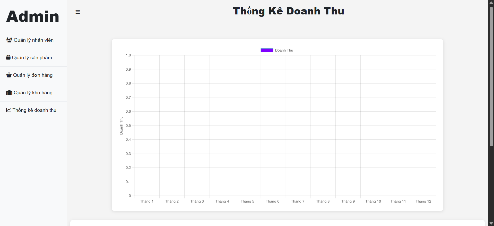

# 🛍️ Clothing Shop Management System

A professional web-based clothing shop management system built with ASP.NET MVC & SQL Server.

## 🔧 Technologies Used

- ASP.NET MVC 5
- Linq Framework
- SQL Server
- Bootstrap 4
- HTML/CSS/JavaScript

## 🎯 Features

- 👕 Product Management (Add, Edit, Delete clothes)
- 📦 Inventory Tracking
- 👥 Customer Management
- 🛒 Order and Invoice Handling
- 📈 Sales Reporting Dashboard
- 🔐 Admin Authentication and Role Management

## 📸 Screenshots

## 🚀 How to Run

1. Clone this repo
2. Open in Visual Studio
3. Configure connection string in `appsettings.json`
4. Run using IIS Express or your preferred web server

## 👨‍💻 Author

- Nguyễn Ngọc Thắng
- [LinkedIn Profile](https://linkedin.com/in/your-name)
